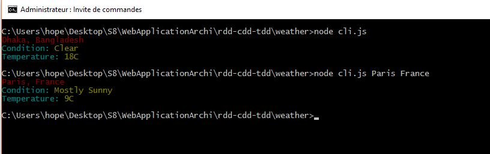

# cli-weather
============

This is a node.js application powered by yahoo yql which give you the condition and temperature for city that you choose.

;

---

## Features
- Choose city and country

---

## Setup
Clone this repo to your desktop and run `npm install` to install all the dependencies.

You can look into `config.json` to see the Outbuildings.

---

## Usage
After you clone this repo to your desktop, go to its root directory and run `npm install` to install its dependencies.

Once the dependencies are installed, you can run  `node cli.js` to start the application.

To choose the city and country, you will have to type `name of city` & `name of country` as arguments in the line commande console.

Exemple: node cli.js Paris France

---

## License
>You can check out the full license [here](https://github.com/IgorAntun/node-chat/blob/master/LICENSE)

This project is licensed under the terms of the **MIT** license.